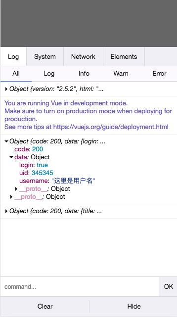

# vue2.0模板

> 针对vue2.0使用，支持多页面生成，支持配置不同环境Build,根据环境.env.js暴露不同公用变量

在vue-cli webpack模板上进行修改。

## 修改/添加功能
- 开发/测试/生产环境区分，暴露环境下不同公有变量
- 多页面build支持
- dllPlugin优化打包，自动引入打包文件
- 基本目录修改
- 辅助插件库
- run dev 下mock数据
- 添加移动端调试v-console

//TODO
- 编译速度优化
- 脚手架

## Build Setup

``` bash
# 安装依赖
npm install

# 开启端口进行调试 port 可以是10000~65535之间的数字
npm run dev port

# dllPlugin打包
npm run dll

# 测试环境编译
npm run build test

# 生产环境编译
npm run build prod
```

## 基本配置修改
### 1.config/dev.js  
npm run dev 调试配置，单个页面进行调试

```
tmpl  //模板原始路径
//调试入口文件，只包括一个页面内容
entry: {
  index: './src/main.js',
},
proxyTable //跨域配置

```

### 2.config/index.js
npm run build 打包配置，支持多页面打包

```
build: {
  //入口文件
  entry: {
    index: './src/main.js',
    secondIndex: '...'
  },
  html: [{
    filename: 'index.html', //模板输出名称
    entrys: ['index'], //页面需要引用的入口文件
    title: '页面1', //html中的title 
    tmplPath: './src/index.ejs' //模板原始路径，默认：'./src/index.ejs'
  }, {
    filename: 'secondPage.html',
    entrys: ['secondIndex'], 
    title: '页面2',
    tmplPath: './src/index.ejs'
  }],
  htmlOutputPath: '../public/', //模板输出路径
  assetsRoot: path.resolve(__dirname, '../public/static/'), //静态资源输出根路径
  assetsSubDirectory: '',
  publicPath: './static/', //和正常的PublicPath相同
  assetsPublicPath: '../', //css内部图片等资源的公有路径
  ...
},
```

## 不同环境区分
在config.*.env.js中进行不同环境配置，使用providePlugin暴露在全局中，通过ENV_OPT变量进行访问。

```
NODE_ENV //环境
isUglyfy //是否压缩代码
其他 //暴露全局变量，如接口等,可自行配置
```

## dllPlugin
利用 DllPlugin 和 DllReferencePlugin 预编译资源模块,避免重复打包等问题
使用 [add-asset-html-webpack-plugin](https://github.com/SimenB/add-asset-html-webpack-plugin) 自动引入页面

### ddlPlugin入口配置
config/lib.dependencies.js

根据需求自行添加，已默认加入vue全家桶。

## 移动端调试 v-console
使用[微信vConsole](https://github.com/WechatFE/vConsole),添加element插件，可以调试log,netWork,Syetem,element等，极大解决了移动端调试难题。

通过环境配置其是否展示，默认开发环境下展示

```
module.exports = merge(prodEnv, {
  NODE_ENV: '"development"',
  isUglyfy: false, //是否压缩
  showVConsole: true, //是否显示v-console
  baseApi: '/mock/'
})
```

;

## mock数据
vue-cli使用express启用服务监听调试，我们直接在express增加路由，mock数据，方便前后端并行开发。

### 使用方式

默认mock接口在 /mock/下

我们统一在config/dev.env.js配置公有接口头为/mock

```
module.exports = merge(prodEnv, {
  NODE_ENV: '"development"',
  isUglyfy: false, //是否压缩
  baseApi: '/mock/'
})
```

然后直接访问即可:

```
get('user').then(r => {
  console.log(r);
})
```

#### 1.使用.json文件mock
mock数据：

``` json
//mock/user.json

{
  "code": 200,
  "data": {
    "login": true,
    "uid": 345345,
    "username": "这里是用户名"
  }
}
```

mock接口：

``` js
//routes/index.js
var user = require('../mock/user.json');

router.get('/user/', function(req, res, next) {
  res.json(Mock.mock(user));
});
``` 

#### 2.使用mock.js进行mock
使用mock.js随机生成数据

[参考文档](http://mockjs.com/0.1/)

``` js
//使用mock.js语法进行mock
var template = {
  'title': 'Syntax Demo',

  'string1|1-10': '★',
  'string2|3': 'value',

  'number6|123.10': 1.123,

  'boolean2|1-2': true,

  'object1|2-4': {
    '110000': '北京市',
    '120000': '天津市',
    '130000': '河北省',
    '140000': '山西省'
  },
  'object2|2': {
    '310000': '上海市',
    '320000': '江苏省',
    '330000': '浙江省',
    '340000': '安徽省'
  },

  'array1|1': ['AMD', 'CMD', 'KMD', 'UMD'],
  'array2|1-10': ['Mock.js'],
  'array3|3': ['Mock.js'],

  'function': function() {
    return this.title
  }
}
var data = Mock.mock({
  'code': 200,
  'data': template
})

router.get('/list/', function(req, res, next) {
  res.json(data);
});
```


